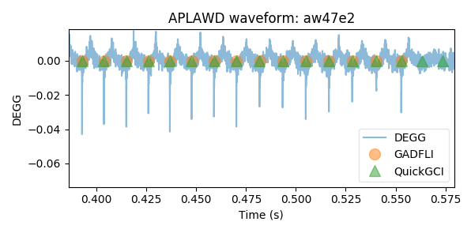

# Introduction

This repository contains code for performing glottal activity detection
on electroglottographic and acoustic speech signals. The primary approach
makes use of the Hilbert transform and its phase to isolate glottal closures.

It is part of the Ph.D. research found in "Hilbert Phase Methods for
Glottal Activity Detection" by Serwy 2017. A copy can be found at:
http://hdl.handle.net/2142/97304

# Running

The "demo" files show examples of GADFLI and QuickGCI applied to waveforms.

